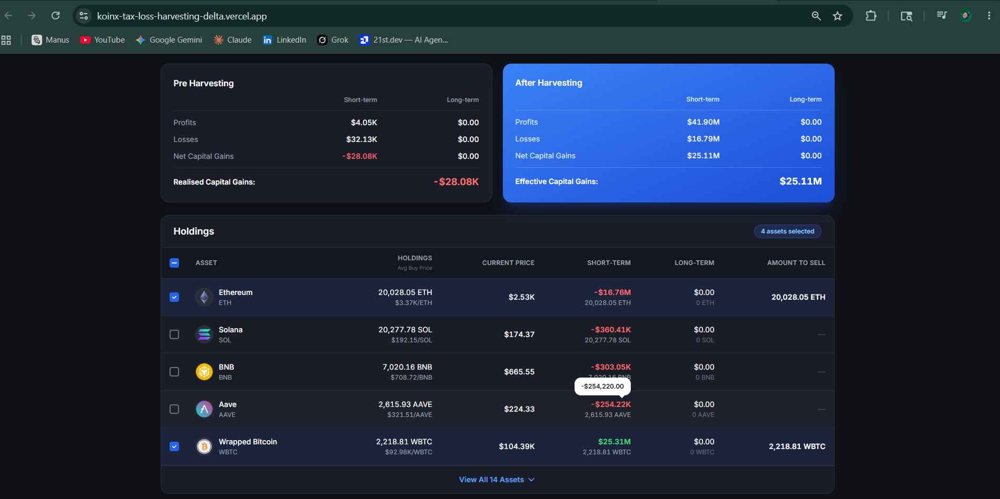
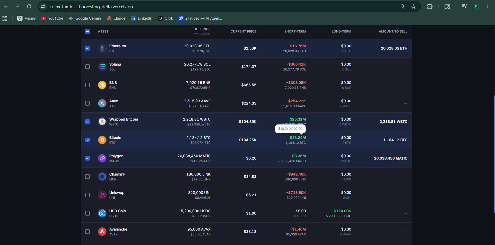
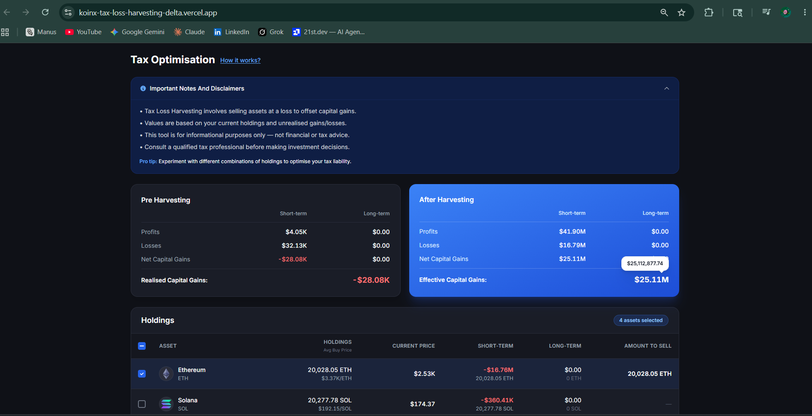

# KoinX — Tax Loss Harvesting Tool

A responsive, production-quality Tax Loss Harvesting interface built with **Next.js 14**, **TypeScript**, and **Tailwind CSS**.

> 🔗 **Live Demo:** _Add your Vercel URL here after deploying_
> 📁 **GitHub:** _Add your GitHub repo URL here_

---

## 📸 Screenshots

> Add screenshots here before submitting (see instructions below)

| Full Page | After Selection | Mobile View |
|---|---|---|
|  |  |  |

---

## 🚀 Setup Instructions

### Prerequisites
- Node.js 18+
- npm

### Run Locally

```bash
npm install
npm run dev
```

Open [http://localhost:3000](http://localhost:3000)

### Build for Production

```bash
npm run build
npm start
```

---

## 🗂 Folder Structure

```
src/
├── app/
│   ├── layout.tsx            # Root layout — mounts TaxProvider (useContext)
│   ├── page.tsx              # Main page — consumes useTax() hook, zero prop drilling
│   └── globals.css
├── components/
│   ├── CapitalGainsCard.tsx  # Pre & After Harvesting cards with tooltips
│   ├── HoldingsTable.tsx     # Holdings table — checkbox select, view all
│   ├── Checkbox.tsx          # Reusable accessible checkbox (indeterminate support)
│   ├── Tooltip.tsx           # Reusable white tooltip (shows full dollar values)
│   ├── HowItWorks.tsx        # "How it works?" popup
│   ├── ImportantNotes.tsx    # Collapsible disclaimer banner
│   └── ErrorState.tsx        # Reusable error UI with retry button
├── context/
│   └── TaxContext.tsx        # useContext + useMemo + useCallback state management
├── mock/
│   ├── capitalGains.ts       # Mock Capital Gains API (Promise-based)
│   └── holdings.ts           # Mock Holdings API (Promise-based)
├── lib/
│   └── utils.ts              # formatCurrency, formatPrice, formatTokenAmount
└── types/
    └── index.ts              # TypeScript interfaces
```

---

## 🧮 Business Logic

### Pre-Harvesting (Left Card — static from API)
```
Net STCG = stcg.profits - stcg.losses
Net LTCG = ltcg.profits - ltcg.losses
Realised Capital Gains = Net STCG + Net LTCG
```

### After Harvesting (Right Card — updates on checkbox selection)
For each **selected** holding:
```
if holding.stcg.gain > 0  →  stcg.profits += gain
if holding.stcg.gain < 0  →  stcg.losses  += |gain|
if holding.ltcg.gain > 0  →  ltcg.profits += gain
if holding.ltcg.gain < 0  →  ltcg.losses  += |gain|
```

Savings banner appears **only when** `preHarvesting.realised > afterHarvesting.realised`

---

## ✅ Bonus Features

| Bonus | Implementation |
|---|---|
| **Mobile responsiveness** | `grid-cols-1 md:grid-cols-2`, `min-w` on table, fluid padding at all breakpoints |
| **Clean, reusable components** | `Checkbox`, `Tooltip`, `ErrorState`, `HowItWorks` — each typed & single-responsibility |
| **Proper state management** | `useContext` + `useMemo` + `useCallback` in `TaxContext.tsx`, wired in `layout.tsx` |
| **Visual feedback for selections** | Row highlight, selected badge counter, Amount to Sell populated, checkbox animation |
| **Loader/Error states** | Skeleton rows during loading; `ErrorState` component with retry on failure |
| **View All functionality** | Shows 5 rows by default; "View All N Assets" / "Show Less" toggle button |

---

## 📌 Assumptions

- All data uses the exact mock responses from the assignment specification
- Currency shown in `$` (USD) with compact notation (K/M) for large values
- Hovering a compacted value shows the full precise amount via white tooltip
- Assets displayed in order returned by Holdings API
- "Amount to Sell" is populated with `totalHolding` when a row is selected
